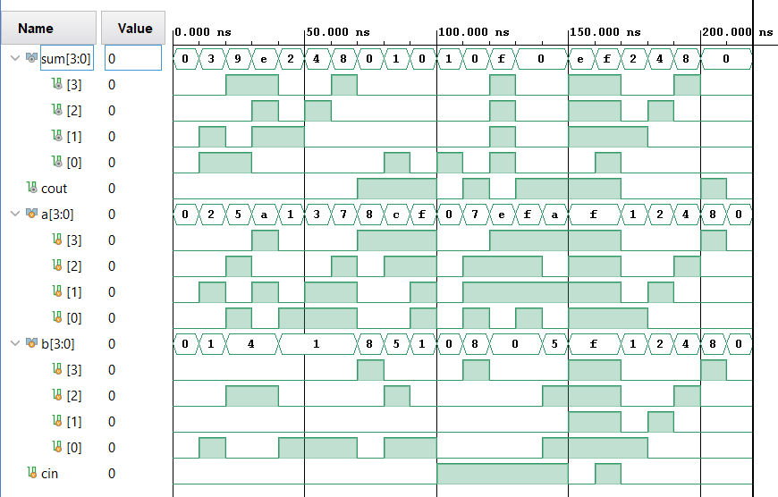
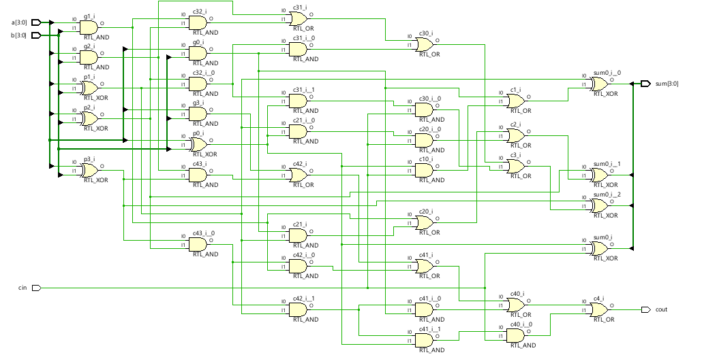
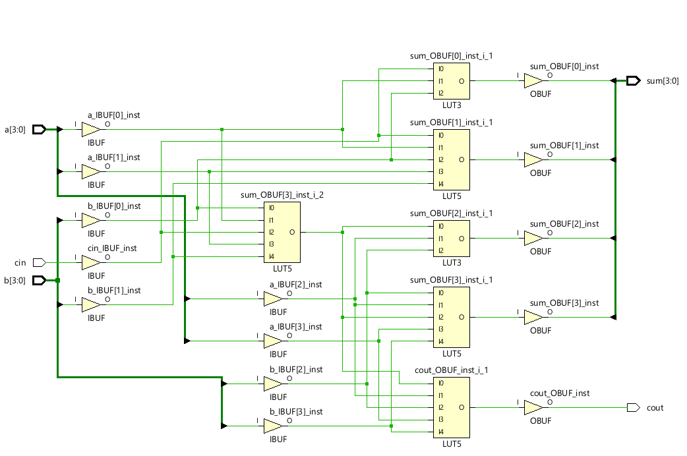

# 4-Bit Carry Lookahead Adder (Verilog)

A high-performance 4-bit Carry Lookahead Adder (CLA) designed, simulated, and synthesized using **Xilinx Vivado**. 

Unlike a traditional Ripple Carry Adder (RCA), which suffers from linear $O(n)$ propagation delay because each full adder stage must wait for the previous one's carry bit, this design implements parallel carry generation logic. By calculating carry bits simultaneously using Propagate ($P$) and Generate ($G$) functions, the lookahead architecture achieves a constant $O(1)$ carry propagation delay, drastically accelerating arithmetic processing.

---

## 🚀 Architecture & Logic Design

The module calculates the internal carries using the following Boolean equations implemented via dataflow operators:

* **Generate ($G_i$):** $G_i = A_i \cdot B_i$
* **Propagate ($P_i$):** $P_i = A_i \oplus B_i$

### Parallel Carry Equations:
* $C_1 = G_0 + (P_0 \cdot C_{in})$
* $C_2 = G_1 + (P_1 \cdot G_0) + (P_1 \cdot P_0 \cdot C_{in})$
* $C_3 = G_2 + (P_2 \cdot G_1) + (P_2 \cdot P_1 \cdot G_0) + (P_2 \cdot P_1 \cdot P_0 \cdot C_{in})$
* $C_4 = G_3 + (P_3 \cdot G_2) + (P_3 \cdot P_2 \cdot G_1) + (P_3 \cdot P_2 \cdot P_1 \cdot G_0) + (P_3 \cdot P_2 \cdot P_1 \cdot P_0 \cdot C_{in})$

The final sum bits are computed directly as: $\text{Sum}_i = P_i \oplus C_i$

---

## 🧪 Simulation & Behavioral Verification

The design was verified using a highly thorough testbench (`stimulus.v`) tracking a variety of complex hexadecimal input combinations to stress-test the lookahead logic under dynamic conditions:

* **Basic Additions:** Validating small-value operations (e.g., at 10ns: `0x2 + 0x1 = 0x3`).
* **Multi-Bit Overflow:** Testing boundaries that saturate the 4-bit space and trip the carry-out flag (e.g., at 30ns: `0xa + 0x4 = 0xe`, and at 70ns: `0x8 + 0x8 = 0x0` with `cout = 1`).
* **Active Carry-In ($C_{in}$):** Checking how a trailing carry shifts outputs across maximum values (e.g., at 110ns: `0x7 + 0x8 + 1 = 0x0` with `cout = 1`).
* **Worst-Case Saturation:** Asserting maximum values across all ports simultaneously (e.g., at 150ns: `0xf + 0xf + 1 = 0xf` with `cout = 1`).

### Behavioral Simulation Waveform


---

## 🛠️ RTL & Synthesis Analysis

The design was mapped and analyzed through two distinct compilation stages in Vivado: **Elaborated RTL** (discrete gates) and **Synthesized Netlist** (FPGA primitives).

### 1. Gate-Level RTL Schematic
Before hardware optimization, the elaborated design maps directly to explicit logic components. This view confirms the pure parallel architecture of the Lookahead logic, showing the discrete layers of `RTL_XOR` gates for propagation, `RTL_AND` arrays for generation, and cascading `RTL_OR` trees resolving the carry channels.



### 2. Synthesized FPGA Mapping
Once fully synthesized for target hardware, Vivado collapses the abstract gate groupings into highly efficient device primitives. Because Xilinx FPGAs utilize programmable logic cells rather than individual transistors, the complex, nested lookahead equations are compressed into fast Look-Up Tables (**LUT3** and **LUT5**) to drastically reduce internal routing path delays.



### Hardware Resource Summary:
* **IBUF / OBUF:** Input and Output hardware buffers handling signal isolation and current amplification.
* **LUT3 (3-Input Look-Up Table):** Maps localized summation (e.g., `sum[0]`).
* **LUT5 (5-Input Look-Up Table):** Condenses wide-variable boolean trees for upper bits and rapid carry generation (`cout`).

---

## 📂 Repository Structure

```text
├── lookahead.v             # Core 4-Bit Carry Lookahead Adder Design
├── stimulus.v              # Comprehensive Testbench with automated verification
├── DOCS/                   # Design documentation and schematics
│   ├── simulation.png        # Verified timing waveform screenshot
│   ├── gate-level-netlist.png # Elaborated logic gate schematic
│   └── fpga-netlist.png      # Synthesized FPGA LUT primitive mapping
└── README.md               # Project Documentation
